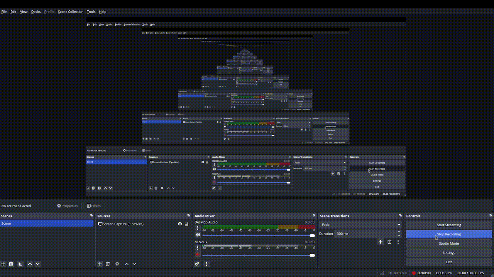

# Py-QR

**Py-QR** is a CLI QR code generator app made with only Python.
It's very simple and prompt-based.
Only supports PNG.

## Libraries & Modules Used

- [Rich](https://github.com/Textualize/rich)
- qrcode
- pathlib
- [loguru](https://github.com/Delgan/loguru)
- [platformdirs](https://github.com/tox-dev/platformdirs)
- [pyfiglet](https://github.com/pwaller/pyfiglet)

### How to Install

Install **Py-QR** locally:

```
git clone https://github.com/stephenjamesada/py-qr.git
cd py-qr
pip install -r requirements.txt
python3 py-qr.py
```

#### Video Showcase


